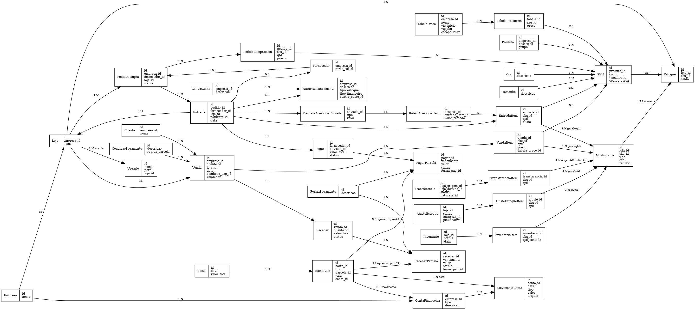

# Modelo de Dados — SysMura (ERD v3)

Este capítulo descreve o **modelo de dados consolidado** do SysMura (versão v3).  
Inclui as entidades principais, relacionamentos, decisões de arquitetura e regras de negócio amarradas ao banco.

---

## 1. Estrutura Organizacional
- **Empresa** → representa o tenant (multi-empresa).
- **Loja** → pertence a uma Empresa; unidade de vendas e estoque.
- **Usuário** → vinculado a uma Loja (`Usuario.loja_id`).

---

## 2. Cadastros Básicos
- **Cliente** → comprador; gera títulos a receber.
- **Fornecedor** → origem de compras; gera títulos a pagar.
- **Produto** → item base, sem variação.
- **Cor / Tamanho** → catálogos para variação.
- **SKU** → combinação de Produto + Cor + Tamanho; nível que movimenta estoque.

---

## 3. Precificação
- **Tabela de Preço** → lista de preços, com vigência (início/fim), escopo Empresa e opcionalmente Loja.
- **Tabela de Preço Item** → preço de um SKU dentro da tabela.

---

## 4. Natureza & Centro de Custo
- **Centro de Custo** → agrupador contábil/gerencial.
- **Natureza de Lançamento** → define reflexo:
  - `tipo_estoque`: ENTRADA / SAIDA / NENHUM
  - `tipo_financeiro`: GERA_TITULO / BAIXA_DIRETA / NENHUM
  - vinculado a um Centro de Custo.

---

## 5. Compras & Entradas
- **Pedido de Compra** → documento obrigatório, vinculado a Fornecedor e Loja.
- **Pedido de Compra Item** → SKUs, quantidades e preços.
- **Entrada** → recebimento baseado em Pedido; possui Natureza.
- **Entrada Item** → SKUs recebidos, quantidades e custos.
- **Despesa Acessória de Entrada** → frete, seguro, impostos etc.
- **Rateio Acessória Item** → distribui despesas acessórias por item para cálculo de custo real.

---

## 6. Estoque
- **Estoque** → saldo por Loja + SKU.
- **Movimentação de Estoque** → qualquer entrada/saída, gerada por documentos.

### Operações especiais
- **Ajuste de Estoque** (ganho/perda) + itens.
- **Inventário** + itens (contagem e ajustes).
- **Transferência** + itens (origem/destino entre lojas).

---

## 7. Vendas
- **Venda** → documento de venda, com Cliente, Loja, Condição de Pagamento e opcional Vendedor.
- **Venda Item** → SKUs vendidos, quantidade, preço, tabela de preço.
- **Condição de Pagamento** → regras de parcelamento.
- **Forma de Pagamento** → dinheiro, cartão, pix etc.

---

## 8. Financeiro
- **Receber** → título a receber, gerado por Venda.
- **Receber Parcela** → parcelas vinculadas ao Receber, com Forma de Pagamento.
- **Pagar** → título a pagar, gerado por Entrada.
- **Pagar Parcela** → parcelas vinculadas ao Pagar, com Forma de Pagamento.
- **Conta Financeira** → caixa, banco, cartão/adquirente etc.
- **Movimento de Conta** → registros em contas financeiras (débito/crédito).
- **Baixa** → pagamento ou recebimento efetivo.
- **Baixa Item** → vincula parcelas (Receber/Pagar) às contas financeiras e gera Movimento de Conta.

---

## 9. Regras-chave
1. **PO obrigatório** → toda Entrada referencia um Pedido de Compra aprovado.
2. **Rateio de despesas** → despesas acessórias rateadas em itens para custo real.
3. **Operações de estoque formais** → Entradas, Vendas, Ajustes, Inventários e Transferências sempre geram Movimentações de Estoque.
4. **Baixas financeiras** → sempre via Baixa/BaixaItem, que gera Movimento de Conta em uma Conta Financeira.
5. **Natureza de Lançamento** → rege reflexo no estoque e financeiro, além do vínculo com centro de custo.

---

## 10. Decisões de Base (v3)
1. **Usuário vinculado a uma Loja** (N:1).  
   - Futuro: se necessário multi-lojas, criar tabela `UsuarioLoja` N:N.
2. **Rateio de despesas** inicialmente por valor do item.  
   - Futuro: suportar rateio por quantidade e peso/volume.
3. **Transferência entre lojas** requer **aprovação** antes de efetivar no destino.
4. **Baixas parciais** permitidas → uma parcela pode ter várias BaixaItem.
5. **Escopo da Tabela de Preço**: Empresa, com campo opcional para restringir a Loja.
6. **Natureza de Lançamento** padronizada com enums (`tipo_estoque`, `tipo_financeiro`).

---
